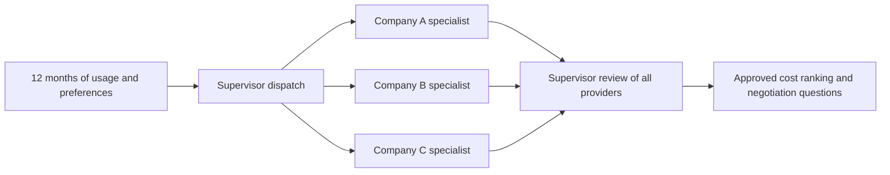

# Electricity Agreement Optimizer

A personal Python project inspired by the specialist/supervisor pattern in Invoice_Manager. A Jupyter notebook orchestrates one LangGraph provider agent per configured company, then a supervisor reviews all results. Shared Pydantic models define extraction, usage, estimates, reviews, and reports. Live mode uses GPT-5 and the OpenAI Responses API; demo mode uses explicitly fictional fixtures without API calls.

## Setup (Windows PowerShell)

Run from this folder. Python 3.11 or newer is required; `py -3` uses your installed Python.

```powershell
py -3 -m venv .venv
.\.venv\Scripts\python -m pip install -r requirements.txt
Copy-Item .env.example .env
.\.venv\Scripts\python -m jupyterlab Electricity_Agreement_Optimizer.ipynb
```

For VS Code, open the notebook and select `.venv\Scripts\python.exe` as the kernel. Run all cells with `MODE = "demo"` first. The notebook generates three fictional PDFs, reads sample usage, runs the actual LangGraph graph, displays reviews and costs, plots monthly charges, and exports JSON and CSV to `outputs/`.

## Compare real agreements

1. Set `OPENAI_API_KEY` in `.env`; `OPENAI_MODEL=gpt-5` is the default.
2. Put text-readable agreement PDFs in `data/private/`. Live mode sends their extracted text to OpenAI, including to the supervisor. Use documents you intend to process through that API. Scanned PDFs require OCR beforehand.
3. Copy `providers.example.json` to `data/private/providers.json`. Set company names, unique IDs, and PDF paths relative to the project folder. Add a row for each company; the graph creates its specialist node automatically. Supply one plan per PDF. Multiple offers from one company can use separate unique IDs.
4. Supply `data/private/usage.csv` with exactly 12 consecutive, distinct months and columns `month,kwh`; use `YYYY-MM-01` dates and nonnegative kWh. See `data/usage_example.csv`.
5. Set `MODE = "live"` in the notebook, adjust paths and preferences, and rerun all cells. This makes billable API requests: one extraction per readable PDF plus one supervisor request.

## Workflow



The supervisor dispatches all specialists through LangGraph and waits for all workers before review. Each specialist extracts its own PDF into `PlanTerms`, with page-numbered quotations. Python checks source quote presence, pricing completeness, and preferences, then calculates monthly costs with decimal arithmetic. A separate GPT-5 supervisor invocation checks every provider against its original text and proposes negotiation questions. An API failure or invalid supervisor coverage withholds approval; a failed provider does not prevent reviewing the others.

The best-fit objective is the lowest first-year estimated cost among approved plans satisfying maximum contract length and minimum renewable percentage. Equal costs use provider ID as a deterministic tie break. The ranking is authoritative Python output; the supervisor cannot overwrite the calculated totals. Quotes establish source presence, not semantic correctness. Review extracted terms before using a real comparison.

## Cost scope

Supported: fixed USD energy and delivery rates, monthly energy/delivery fees, and one inclusive usage-threshold bill credit. Monthly bill = kWh × (energy cents + delivery cents) / 100 + fixed fees − eligible credit. Each month is rounded to cents before summing. The user-supplied switching cost is added once to every candidate's first-year total; it should include any current-contract exit cost. The candidate's own early termination fee is shown in terms, not automatically charged.

Unknown pricing, unresolved fees or conditions, variable/time-of-use/tiered plans, and contracts shorter than the 12-month comparison horizon are excluded. Missing charges are never assumed to be zero. Taxes are excluded. This is a historical usage replay, not a forecast; delivery-rate changes and future availability are not verified. Confirm location eligibility and current offers independently. The tool proposes negotiation questions; it does not modify agreements or contact providers. No savings relative to a current plan are claimed without a baseline comparison.

## Files and verification

- `Electricity_Agreement_Optimizer.ipynb`: guided demo/live workflow and visual comparison.
- `electricity_ao/models.py`: shared validation contracts.
- `electricity_ao/agents.py`: GPT-5 structured extraction and supervisor prompts.
- `electricity_ao/workflow.py`: provider nodes, join, evidence checks, final ranking.
- `electricity_ao/costs.py`: reproducible usage-based calculations.
- `electricity_ao/demo.py`: fictional PDF fixtures and offline backend.
- `tests/test_workflow.py`: cost thresholds, usage validation, full graph, and failure handling.

```powershell
.\.venv\Scripts\python -m pytest -q
.\.venv\Scripts\python verify_notebook.py
```

Dependency ranges are in `requirements.txt`; `requirements-lock.txt`, when present, records the tested environment. Demo tests validate orchestration and calculations, not GPT-5 extraction quality on real agreements. Evaluate real provider PDFs manually before describing accuracy or consumer savings on a resume.

Implementation references: [OpenAI structured outputs](https://developers.openai.com/api/docs/guides/structured-outputs), [GPT-5](https://developers.openai.com/api/docs/models/gpt-5), and [LangGraph Graph API](https://docs.langchain.com/oss/python/langgraph/graph-api).
